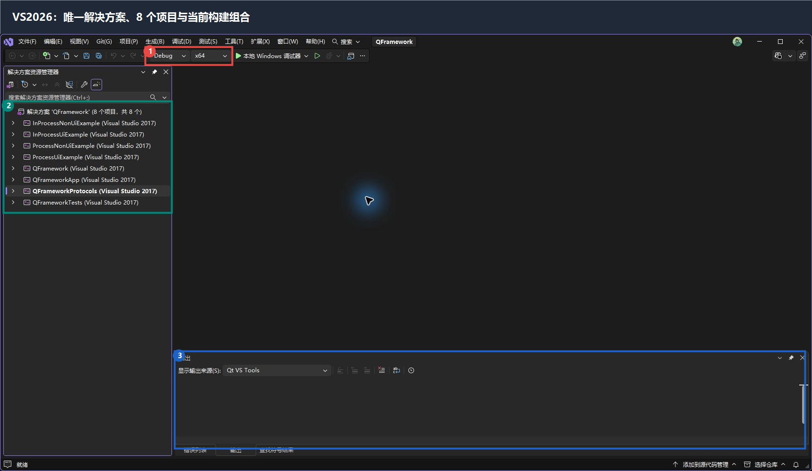
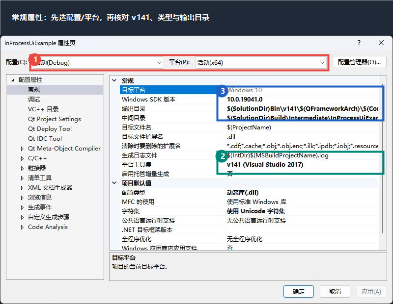
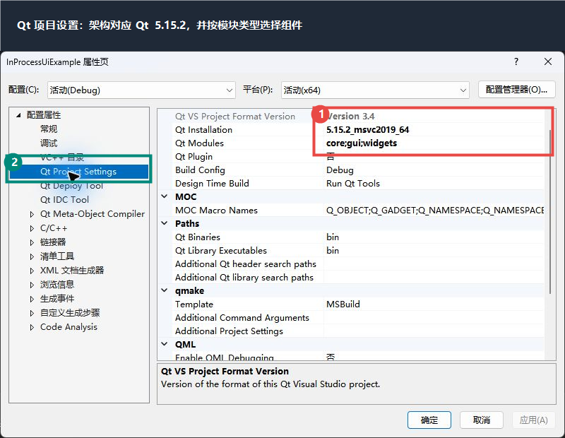
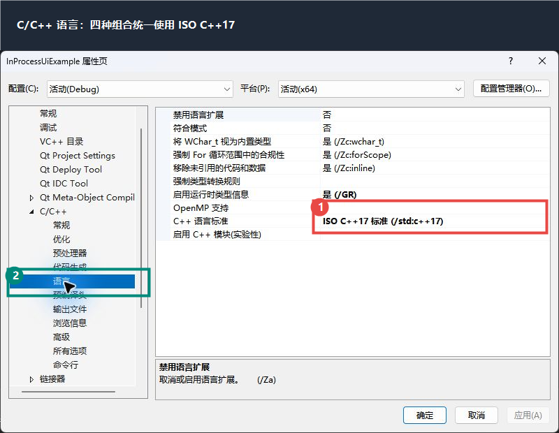
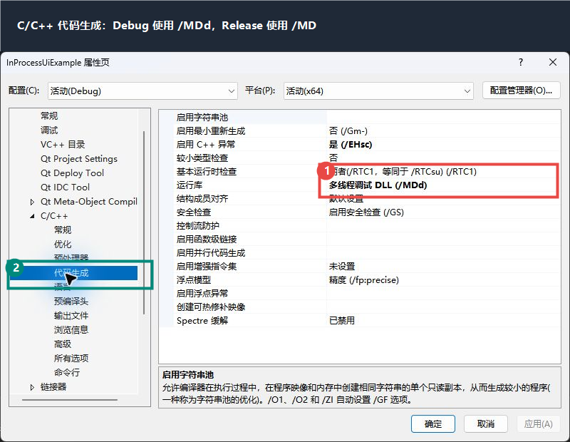
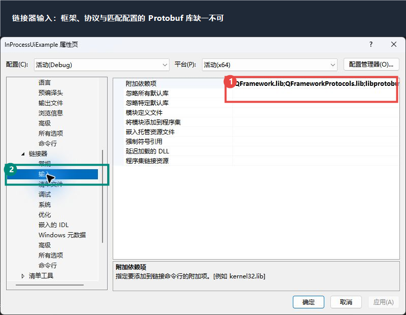

# 教程：创建并配置四类模块

本教程适合已经会创建普通 Qt/C++ 项目，但第一次接入 QFramework 的开发者。完成后，你会得到一个位于 `Modules\<ModuleId>`、加入唯一 `QFramework.sln`、可在 Win32/x64 和 Debug/Release 下构建的模块。

## 1. 先确定模块类型

| 模块类型 | 项目输出 | 基类 | Qt 组件 | 额外文件 |
| --- | --- | --- | --- | --- |
| `InProcessUi` | DLL | `qframework::InProcessUiModule` | `core;gui;widgets` | 插件 JSON、`Q_PLUGIN_METADATA` |
| `InProcessNonUi` | DLL | `qframework::InProcessNonUiModule` | `core` | 插件 JSON、`Q_PLUGIN_METADATA` |
| `ProcessUi` | EXE | `qframework::ProcessUiModule` | `core;gui;widgets;network` | `QApplication` 入口 |
| `ProcessNonUi` | EXE | `qframework::ProcessNonUiModule` | `core;network` | `QCoreApplication` 入口 |

UI 模块在主窗口中对应一个 Dock；非 UI 模块没有 Dock。只有主进程 DLL 使用 Qt 插件元数据。子进程 EXE 必须由框架启动，不能作为普通独立程序运行。

## 2. 在唯一解决方案中创建项目

1. 用 VS2026 或 VS2017 打开仓库根目录的 `QFramework.sln`。
2. 通过“添加新项目”创建 Qt 默认 DLL 或 EXE 项目。
3. 把项目目录设为 `Modules\<ModuleId>`，并把项目加入当前解决方案。
4. 不创建第二个 `.sln`，不引入 qmake、CMake、自定义模块模板或仓库共享 `.props`。
5. 为项目建立 `Debug|Win32`、`Debug|x64`、`Release|Win32`、`Release|x64` 四个组合。



图中 1 是当前配置和平台，2 是解决方案中的 8 个实际项目，3 是构建输出窗口。新模块加入后也应出现在同一个解决方案中。

## 3. 配置常规属性

在“项目属性”中逐一核对四个配置组合：

| 属性 | 值 |
| --- | --- |
| Windows SDK 版本 | `10.0.19041.0` |
| 平台工具集 | `v141` |
| 字符集 | Unicode |
| DLL 模块配置类型 | 动态库 `.dll` |
| 子进程模块配置类型 | 应用程序 `.exe` |

每个项目在 `.vcxproj` 内联定义架构名：

```xml
<QFrameworkArch Condition="'$(Platform)'=='Win32'">x86</QFrameworkArch>
<QFrameworkArch Condition="'$(Platform)'=='x64'">x64</QFrameworkArch>
```

输出目录和中间目录使用：

```text
$(SolutionDir)Bin\v141\$(QFrameworkArch)\$(Configuration)\Plugins\<ModuleId>\
$(SolutionDir)Build\Intermediate\<ModuleId>\$(QFrameworkArch)\$(Configuration)\
```



## 4. 选择匹配架构的 Qt

在 `Qt Project Settings` 中设置：

| 平台 | Qt Installation |
| --- | --- |
| Win32 | `5.15.2_msvc2019` |
| x64 | `5.15.2_msvc2019_64` |

`Qt Modules` 使用第 1 节表格中的值。Qt 包名中的 `msvc2019` 不会改变项目的 `v141` 工具集。当前主进程 DLL 示例的 `Qt Plugin` 属性保持“否”，插件身份由源码中的 `Q_PLUGIN_METADATA` 声明。



## 5. 配置 C++ 编译选项

在 `C/C++` 中配置以下值：

| 属性 | 值 |
| --- | --- |
| 附加包含目录 | `$(SolutionDir)Source\QFrameworkSdk` |
|  | `$(SolutionDir)Source\QFrameworkProtocols` |
|  | `$(SolutionDir)Source\QFrameworkProtocols\Generated` |
|  | `$(SolutionDir)ThirdParty\Protobuf\3.21.12\include` |
| 预处理器定义 | `WIN32_LEAN_AND_MEAN;NOMINMAX;PROTOBUF_USE_DLLS;QFRAMEWORK_PROTOCOLS_EXPORT=__declspec(dllimport)` |
| C++ 语言标准 | ISO C++17 `/std:c++17` |
| 警告级别 | `/W4` |
| 异常处理 | `/EHsc` |
| 运行时类型信息 | `/GR` |
| 其他选项 | `/utf-8` |
| Debug 运行库 | 多线程调试 DLL `/MDd` |
| Release 运行库 | 多线程 DLL `/MD` |





## 6. 配置链接与项目引用

附加库目录：

```text
$(SolutionDir)Build\Lib\v141\$(QFrameworkArch)\$(Configuration)
$(SolutionDir)ThirdParty\Protobuf\3.21.12\lib\$(QFrameworkArch)\$(Configuration)
```

附加依赖项：

| 配置 | 库 |
| --- | --- |
| Debug | `QFramework.lib;QFrameworkProtocols.lib;libprotobufd.lib` |
| Release | `QFramework.lib;QFrameworkProtocols.lib;libprotobuf.lib` |

同时添加对 `Source\QFramework\QFramework.vcxproj` 和 `Source\QFrameworkProtocols\QFrameworkProtocols.vcxproj` 的项目引用。PDB 放到模块的 `$(OutDir)`。



## 7. 正确设置 Qt 项目项类型

包含 `Q_OBJECT` 的头文件必须作为 `QtMoc` 项加入项目；普通 `.cpp` 使用 `ClCompile`，插件 JSON 使用 `None`。同一路径不能同时作为 `QtMoc` 和 `ClInclude` 出现，否则 VS2026 会拒绝加载项目。

```xml
<ItemGroup>
  <QtMoc Include="MyModule.h" />
  <ClCompile Include="MyModule.cpp" />
  <None Include="MyModule.json" />
</ItemGroup>
```

## 8. 实现主进程 DLL 模块

主进程 UI 模块：

```cpp
#include "InProcessUiModule.h"
#include "QFrameworkPlugin.h"

class MyUiModule final : public qframework::InProcessUiModule
{
    Q_OBJECT
    Q_PLUGIN_METADATA(IID QFRAMEWORK_PLUGIN_IID FILE "MyUiModule.json")

public:
    explicit MyUiModule(QWidget* parent = nullptr);
};
```

主进程非 UI 模块把基类改为 `qframework::InProcessNonUiModule`，构造参数改为 `QObject*`。两个 DLL 都需要元数据：

```json
{
  "ModuleId": "MyUiModule",
  "ModuleType": "InProcessUi"
}
```

`ModuleId`、`ModuleType`、DLL 文件名和 INI 注册项必须相互一致。

## 9. 实现子进程 EXE 模块

子进程类分别继承 `ProcessUiModule` 或 `ProcessNonUiModule`，不使用 `Q_PLUGIN_METADATA`。入口保持最小。

UI 子进程：

```cpp
#include <QApplication>
#include "ProcessRuntime.h"
#include "MyProcessUiModule.h"

int main(int argc, char* argv[])
{
    QApplication application(argc, argv);
    return qframework::ProcessRuntime::run(
        &application, new MyProcessUiModule);
}
```

非 UI 子进程使用 `QCoreApplication` 和 `MyProcessNonUiModule`。不要解析或伪造框架传入的 IPC 参数；`ProcessRuntime` 负责令牌、注册、心跳、消息与共享内存。

## 10. 声明主题并手工序列化 Protobuf

模块在启动前静态声明发布和订阅主题：

```cpp
QStringList MyModule::publishedTopics() const
{
    return QStringList() << QString::fromLatin1(QFRAMEWORK_STATUS);
}

QStringList MyModule::subscribedTopics() const
{
    return QStringList() << QString::fromLatin1(QFRAMEWORK_LOG_DISPLAY);
}
```

框架会先开放当前模块的发布入口，再调用 `onStart()`，所以启动回调可以直接发布
初始化结果。例如：

```cpp
bool MyModule::onStart()
{
    const QByteArray ready("ready");
    if (!publish(QString::fromLatin1(QFRAMEWORK_STATUS), ready)) {
        logError(QString::fromUtf8(u8"发布启动状态失败"));
        return false;
    }
    return true;
}
```

如果 `onStart()` 返回 `false` 或抛出异常，框架会立即撤销发布权限并把本模块标记
为启动失败；之后的 `publish()` 会返回 `false`。实际项目应把 `ready` 换成对应的
Protobuf 序列化结果。

发送前手工序列化，接收后手工解析：

```cpp
qframework::protocols::ModuleStatus status;
status.set_module_id("MyModule");

std::string bytes;
if (!status.SerializeToString(&bytes)) {
    logError(QString::fromUtf8(u8"序列化状态消息失败"));
    return false;
}
return publish(QString::fromLatin1(QFRAMEWORK_STATUS),
               QByteArray::fromStdString(bytes));
```

UI 模块的 `onMessage()` 在模块消息线程执行。它只能解析数据并发射信号，界面更新必须通过显式 `Qt::QueuedConnection` 切回 GUI 线程。

## 11. 在 QFramework.ini 注册模块

先把模块 ID 加到 `[Modules]/Names` 的目标位置，再添加对应分组：

```ini
[Module.MyUiModule]
Enabled=true
Type=InProcessUi
DisplayName=我的界面模块
FilePath=../Plugins/MyUiModule/MyUiModule.dll
WaitForDebugger=false
DebuggerWaitTimeoutMs=30000
```

四类 `Type` 值必须使用 `InProcessUi`、`InProcessNonUi`、`ProcessUi`、`ProcessNonUi` 之一。相对路径从运行目录中的 `config` 目录解析。程序不会替你修改此文件。

## 12. 第一次构建与运行

1. 先生成 `QFrameworkProtocols` 和 `QFramework`，再生成新模块与 `QFrameworkApp`；项目引用通常会自动保证顺序。
2. 对当前配置执行“重新生成解决方案”，确认输出为 0 个失败项目。
3. 手工把仓库的 `config` 目录复制到对应 `Bin\v141\<架构>\<配置>` 目录。
4. 确认模块文件位于 `Plugins\<ModuleId>`，并存在匹配架构和配置的 Qt、QFramework、QFrameworkProtocols 与 Protobuf DLL。
5. 启动 `QFrameworkApp.exe`。UI 模块默认隐藏，通过“模块”菜单或左侧工具栏显示。

## VS2017 差异

VS2017 的属性页布局和 Qt Visual Studio Tools 菜单名称可能与截图不同，但项目值完全相同：仍使用 `v141`、C++17、Qt 5.15.2、对应架构的 Protobuf 库和同一输出目录。不要在 VS2017 中升级工具集，也不要让 VS2026把项目重定向到更高工具集。
